# Hangman Game

Welcome to the Hangman Game! This is a Python command-line application where players guess a randomly chosen word one letter at a time until they reveal the full word.

## Table of Contents

1. [Project Overview](#project-overview)
2. [Features](#features)
3. [Technologies Used](#technologies-used)
4. [How to Play](#how-to-play)
5. [Testing](#testing)
6. [Screenshots](#screenshots)
7. [Deployment](#deployment)
8. [Future Enhancements](#future-enhancements)
9. [Credits](#credits)
10. [Acknowledgements](#acknowledgements)

### Project Overview

The Hangman game is a classic word-guessing game where players aim to guess a hidden word by suggesting letters within a limited number of attempts. This project demonstrates fundamental programming concepts such as:
* Input validation
* Conditional logic
* Iteration
* Use external libraries for styling the terminal

### Features

- **Random word selection**: A random word is chosen from a predefined word bank.
- **Player guess input**: Players can guess one letter at a time.
- **Word progress**: Display the word with guessed letters revealed and underscores for unguessed letters.
- **Remaining attempts**: Track and display the number of attempts left.
- **Win/Lose condition**: The game ends when the player guesses the word or runs out of attempts.

### Technologies Used

- **Python 3**: Programming language.
- **Colorama**: Enables adding colors to terminal text for better user experience. Provides feedback on valid inputs, invalid inputs and game outcomes.

### How to Play

1. Press 'RUN PROGRAM' to start the game, and the rules will be displayed.
2. Guess one letter at a time.
3. If your guess is correct, it will appear in the word progress and the terminal will display a green message as feedback.
4. If your guess is incorrect, your remaining attempts will decrease and the terminal will display a red message as feedback.
5. Win the game by guessing the word before running out of attempts.
6. Type 'exit' at any time to quit the game.

### Testing

#### Valid Inputs:
- Single letter guesses (uppercase and lowercase treated the same).
- Correct and incorrect guesses update the game state as expected.

#### Invalid Inputs:
- Numbers, special characters, multiple letters and empty spaces are rejected with appropriate message.
- Repeated guesses are handled without decreasing the number of attempts.

#### Win and Lose Conditions:
- Tested both, winning by guessing the word and losing by using all the attempts.

#### Validation:
- Code checked with PEP8 using online tools like https://pep8ci.herokuapp.com/ .

### Screenshots

**Main Interface** 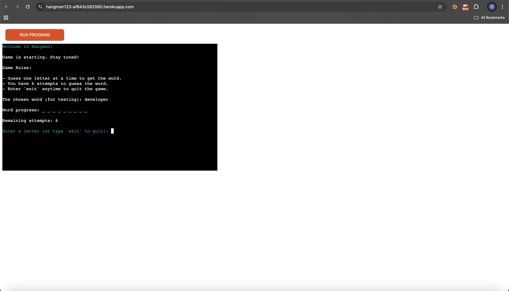
**Game View in Terminal** 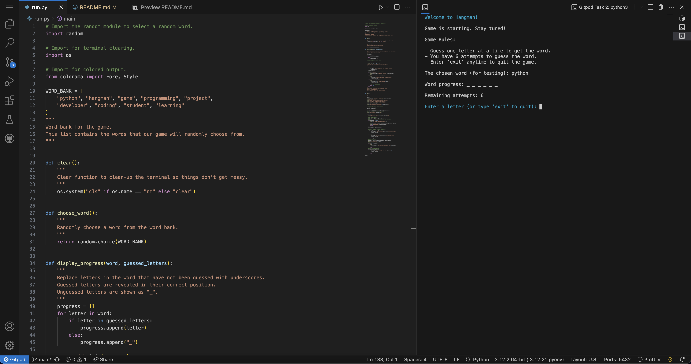
**Linter Error/Warning** 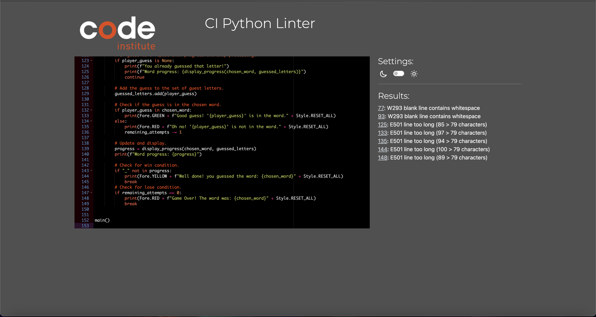
**Fix Linter Error/Warning** 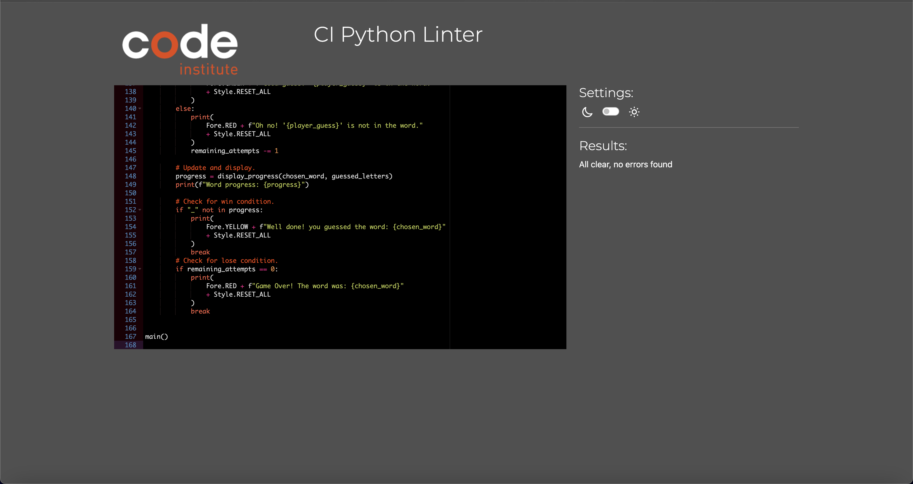
**Colorama Error** 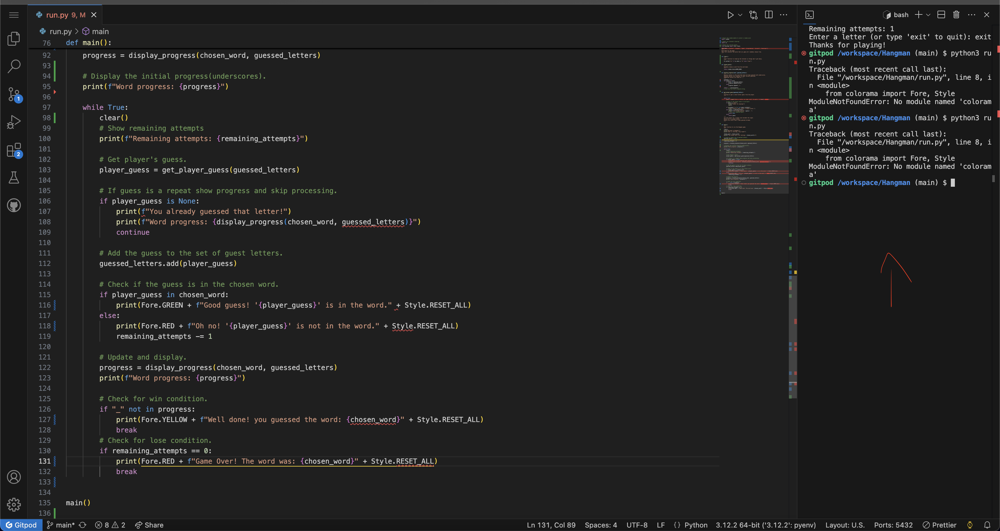
**Fix Colorama Error** 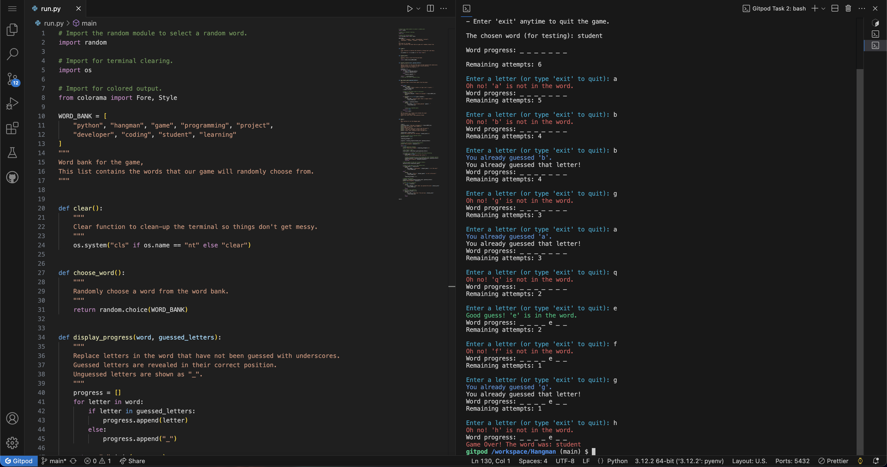
**Replay Function Error** 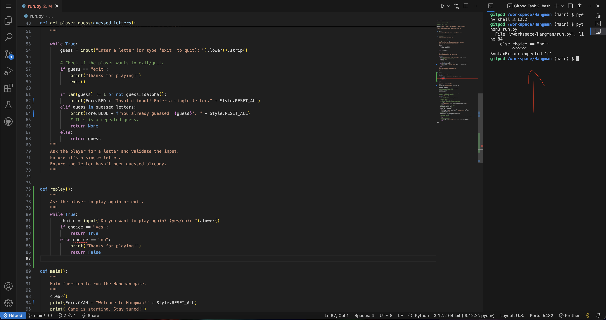
**Valid Input Feedback** 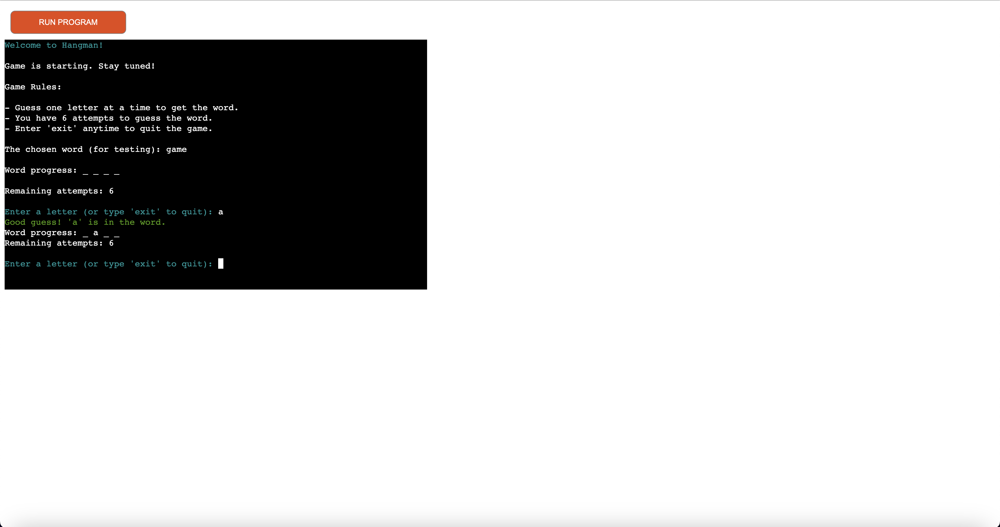
**Invalid Input Feedback** 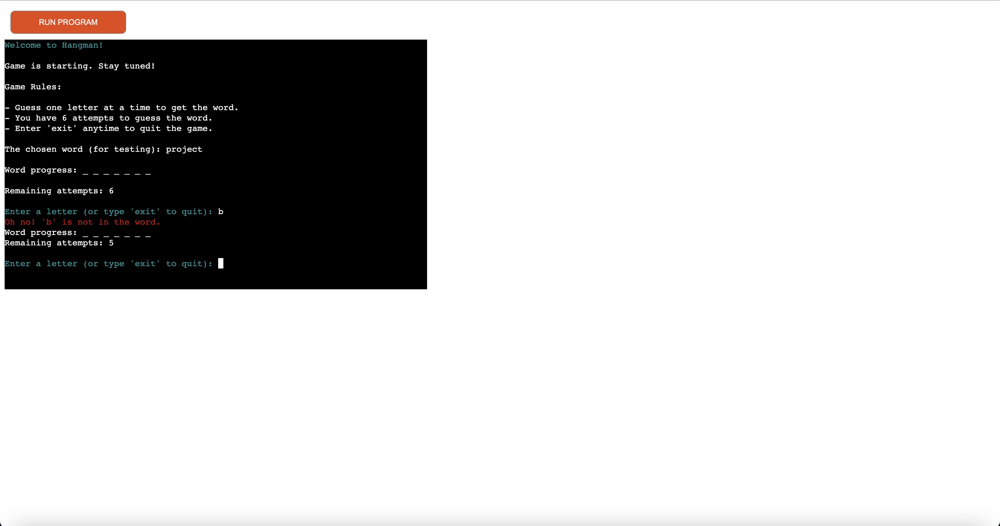
**Same Guess Feedback** 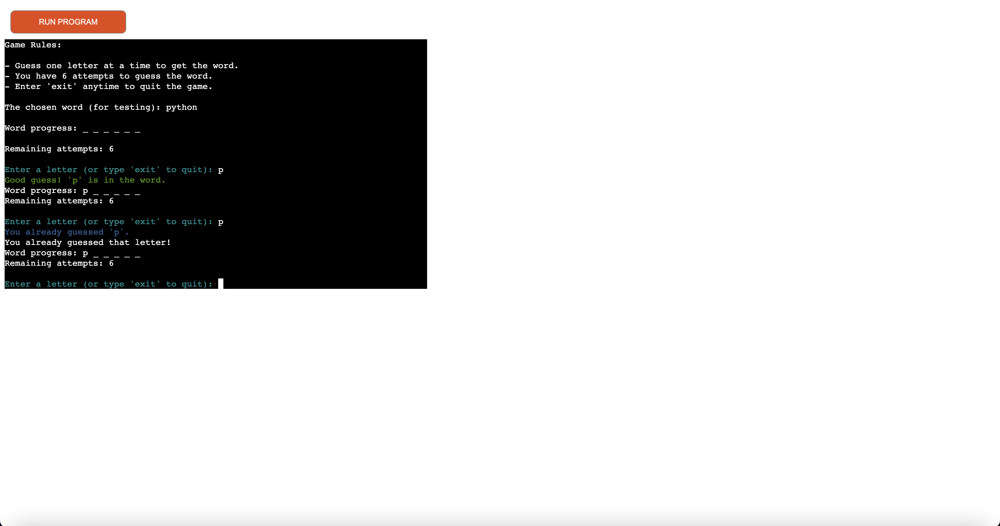
**Win Game Feedback** 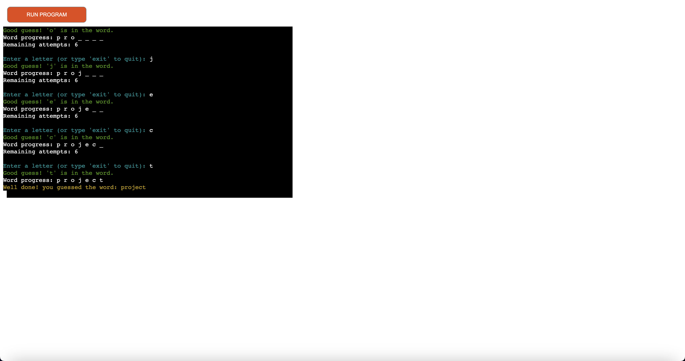
**Lose Game Feedback** 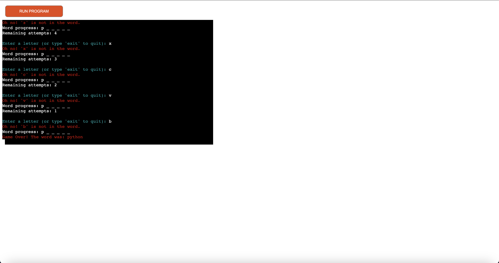

### Deployment

This application was deployed on [Heroku](https://www.heroku.com/) using the following steps:
1. Ensure the requirements.txt is up to date: pip freeze > requirements.txt
2. Create a new Heroku app and connect your GitHub repository.
3. Add the following buildpacks in this order:
- heroku/python
- heroku/nodejs (required for Code Institute's template)
4. Deploy the app and test if it works.

### Future Enhancements

- **Replay Option**: Allows the player to restart the game without relaunching the application.
- **Difficulty Levels**: Add multiple difficulty levels like different word lengths or attempt limits.
- **Score Tracking**: Add a scoring system to track player performance across games.

### Credits

- [Code Institute](https://codeinstitute.net/) - Primary learning platform.
- [Colorama](https://pypi.org/project/colorama/) - Used for styling the terminal output.
- [MDN Web Docs](https://developer.mozilla.org/) - Web development documentation and guides.
- [W3Schools](https://www.w3schools.com/) - Quick references and tutorials.
- [Udemy](https://www.udemy.com/) - Additional Python online course content.
- [YouTube](https://www.youtube.com/) - Various tutorials and channels for specific implementation techniques.

### Acknowledgements

I would like to express my gratitude to:
- My mentor, [Rory Patrick Sheridan](https://github.com/Ri-Dearg) for his valuable guidance, insights, and encouragement throughout this project.
- [Code Institute](https://codeinstitute.net/) for providing a learning environment and resources necessary for this project.
- The [Code Institute Tutor Support Team](https://learn.codeinstitute.net/ci_support/disdcc_3/support) for technical assistance whenever I faced challenges.
- The [Code Institute Slack community](https://code-institute-room.slack.com) for extra support and offering solutions to common problems.